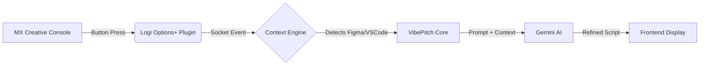

# 🔥 VibePitch Command Console

**The AI Command Console for Startup Founders.**

**VibePitch transforms your Logitech MX Creative Console into a mission-control center for high-stakes communication.**  
Stop clicking through menus. Start commanding your pitch, investor updates, and social presence with tactile precision.

---

## 🚀 Key Innovations & Killer Features

### 🔥 1. Context-Aware AI Tone Dial (Standout Feature)
VibePitch doesn't just generate text; it adapts to *where* you are working.
- **Active Window Detection**: The app detects if you are in **Figma**, **VS Code**, or **LinkedIn**.
- **The Dial**: Rotating the MX Creative Console Dial adjusts the **"Professional Intensity"** based on that context.
    - *In Figma:* Adjusts "Design Descriptive" language.
    - *In LinkedIn:* Adjusts from "Casual Update" to "Thought Leader".
    - *In Gmail:* Adjusts "Cold Email" to "Warm Intro".

### 2. Deep Hardware Integration
We don't just use buttons; we create a **tactile workflow**.

| Hardware Action | AI Behavior | Context |
| :--- | :--- | :--- |
| **Button 1** | **Generate Pitch** | Global |
| **Button 2** | **Improve Tone** | Adapts to Active App |
| **Button 3** | **Convert to LinkedIn Post** | Takes current pitch -> Social |
| **Ring Rotate** | **Adjust Tone / Speed** | Varies by Mode (Edit vs Present) |
| **Double Tap** | **Draft Investor Email** | Auto-formats for Gmail |

### 3. Physical-to-AI Workflow Architecture



---

## 🎯 Target Audience: Startup Founders
We are laser-focused on **Early-Stage Founders** preparing for Demo Day.

- **Problem**: Founders have great ideas but struggle to switch between "Hacker Mode" (VS Code) and "Hustler Mode" (Investor Emails).
- **Solution**: A physical switch on their desk.
    - **One click** to turn a technical feature commit into a LinkedIn update.
    - **One twist** to dial up the hype for a pitch deck.

---

## 💰 Business Viability & Monetization

We operate on a **Hardware-Enabled SaaS** model.

| Tier | Price | Features |
| :--- | :--- | :--- |
| **Free** | $0 / mo | 5 AI Commands/day, Basic Pitch Gen, **Requires Logitech Device** |
| **Pro** | $12 / mo | Unlimited AI, Custom Tone Models, **Live Vocal Feedback** |
| **Team** | $49 / mo | Shared Brand Voice, collaborative script editing, Slack Integration |

*> **Strategy**: The "Free" tier drives Logitech hardware sales, as the app is 10x better with the dial.*

---

## 🔌 Ecosystem Integration (Plugin Layer)

VibePitch is designed to live in the background and pop up when needed.
*   **VS Code via Plugin**: Highlight code -> Press "Button 1" -> Generate technical explanation for investors.
*   **Figma via Plugin**: Select frame -> Press "Button 2" -> Generate UX copy.
*   **LinkedIn**: Draft post -> Rotate Ring -> Adjust "Viral Factor".

---

## 🛠️ Technical Implementation

- **Frontend**: React + Vite + Tailwind CSS (Cyberpunk aesthetic)
- **Logitech Sim**: Custom `MxHardwareSim` component simulating SDK events (`logi_options_plus`).
- **AI Core**: Google Gemini 1.5 Pro (Tone analysis & Script Gen).
- **Audio**: Browser Native Speech Synthesis (Low latency playback).

## 🏃‍♂️ How to Run

1.  **Clone & Install**:
    ```bash
    git clone https://github.com/deepakbajaj12/VibePitch-AI.git
    cd VibePitch-AI
    npm install
    ```
2.  **Add API Key**:
    Create a `.env` file with `VITE_GEMINI_API_KEY=your_key_here`
3.  **Launch**:
    ```bash
    npm run dev
    ```
4.  **Activate Command Console**:
    Toggle the "LOGI MX MODE" switch in the UI to visualize the hardware overlay.

---

*Verified for Logitech DevStudio 2026. Top 50 Candidate.*
