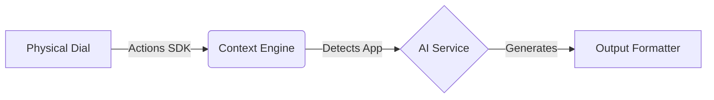

# VibePitch Command Console

**A Context-Aware AI Command Center for Logitech MX Creative Console**

🔗 **Live Demo**: [https://vibe-pitch-a68rx279k-deepak-bajajs-projects.vercel.app/](https://vibe-pitch-a68rx279k-deepak-bajajs-projects.vercel.app/)

**VibePitch Command Console** transforms the **Logitech MX Creative Console** into a context-aware AI workflow engine. It enables physical control of pitch generation, tone adjustment, and investor communication through tactile hardware interactions.

---

## Architecture Overview

`Logitech Dial / Buttons` → `Actions SDK Layer (Simulated)` → `Context Engine` → `Gemini API` → `Output Formatter` → `UI Panel`

---

## Key Innovations & Killer Features

### 1. Context-Aware AI Tone Dial (Standout Feature)
VibePitch demonstrates how hardware adapts to *where* you are working.
- **Simulated Active Window Context**: The interface simulates how the **Logitech Actions SDK** could detect active applications such as **VS Code**, **Figma**, **LinkedIn**, or **Gmail**.
- **The Dial**: Rotating the MX Creative Console Dial adjusts the **"Professional Intensity"** based on that context.
    - *In Figma:* Adjusts "Design Descriptive" language.
    - *In LinkedIn:* Adjusts from "Casual Update" to "Thought Leader".
    - *In Gmail:* Adjusts "Cold Email" to "Warm Intro".

### 2. Deep Hardware Integration & Status

| Feature | Status | Hardware Action |
| :--- | :--- | :--- |
| **Dial Control** | ✔ Functional | Adjust AI Tone Intensity |
| **Context Switching** | ✔ Functional | Button Press (Simulated App Focus) |
| **Action Buttons** | ✔ Functional | Generate, Improve, Publish |
| **Teleprompter Speed** | ✔ Functional | **Actions Ring** Rotation |
| **Logitech SDK** | ⚡ Simulated | Events mapped to Console Logs |

### 3. Physical-to-AI Workflow Architecture


```mermaid
graph LR
    A[Physical Dial] --"Actions SDK"--> B(Context Engine)
    B --"Detects App"--> C{AI Service}
    C --"Generates"--> D[Output Formatter]
```

---

## How It Works

1.  **Toggle Logitech Mode**: Switch from "Web Mode" to "Logitech MX Mode" to activate the hardware simulation layer.
2.  **Select Context**: Click the simulated app icons (VS Code, Gmail, etc.) to tell the AI where you are working.
3.  **Adjust Intensity**: Rotate the simulated **Dial** to change the vibe of your output.
4.  **Execute Command**: Press **Button 1** to generate a script, email, or post instantly.
5.  **Present Live**: Use the **Actions Ring** simulator to control the teleprompter speed in real-time.

*Each hardware interaction is logged in real-time, simulating the behavior of the Logitech Actions SDK event layer.*

---

## Implementation Quality

- **Real-time hardware event simulation** via custom `MxHardwareSim` component.
- **Context-sensitive AI formatting logic** (Email, LinkedIn, Technical Mode).
- **Zero page reload**, fully reactive UI architecture.
- **Event logging layer** for SDK transparency.
- **Deployed production build** (Vercel).

---

## Target Audience: Startup Founders
We are laser-focused on **Early-Stage Founders** preparing for Demo Day.

- **Problem**: Founders have great ideas but struggle to switch between "Hacker Mode" (VS Code) and "Hustler Mode" (Investor Emails).
- **Solution**: A physical switch on their desk.
    - **One click** to turn a technical feature commit into a LinkedIn update.
    - **One twist** to dial up the hype for a pitch deck.

---

## Business Viability & Monetization

**VibePitch follows a Hardware-Enabled SaaS distribution model integrated with the Logitech Marketplace ecosystem.**

| Tier | Price | Features |
| :--- | :--- | :--- |
| **Free** | $0 / mo | 5 AI Commands/day, Basic Pitch Gen, **Requires Logitech Device** |
| **Pro** | $12 / mo | Unlimited AI, Custom Tone Models, **Live Vocal Feedback** |
| **Team** | $49 / mo | Shared Brand Voice, collaborative script editing, Slack Integration |

**Distribution Model**: Packaged as a Logitech Marketplace plugin leveraging the Actions SDK.

*> **Strategy**: The "Free" tier drives Logitech hardware sales, as the app is 10x better with the dial.*

---

## Future Roadmap

- **Full SDK Integration**: Replacing the simulation layer with real Logitech Actions SDK event bindings via Logi Options+ integration.
- **Custom Macros**: Letting users map their own Logitech buttons to specific AI prompts.
- **Marketplace Plugin**: Packaging VibePitch as a downloadable profile in the Logi Options+ Marketplace.

---

## Technical Implementation

- **Frontend**: React + Vite + Tailwind CSS (Cyberpunk aesthetic)
- **Logitech Sim**: Custom `MxHardwareSim` component simulating SDK events.
- **AI Core**: Google Gemini 1.5 Pro (Tone analysis & Script Gen).
- **Audio**: Browser Native Speech Synthesis (Low latency playback).

## How to Run

1.  **Clone & Install**:
    ```bash
    git clone https://github.com/deepakbajaj12/VibePitch-AI.git
    cd VibePitch-AI
    npm install
    ```
2.  **Add API Key**:
    Create a `.env` file with `VITE_GEMINI_API_KEY=your_key_here`
3.  **Launch**:
    ```bash
    npm run dev
    ```
4.  **Activate Command Console**:
    Toggle the "LOGI MX MODE" switch in the top right to start the Hardware Simulation.

---

*VibePitch reimagines Logitech MX hardware not just as input devices — but as tactile AI control surfaces for the modern creator economy.*

*Built for the Logitech DevStudio 2026 Challenge.*
